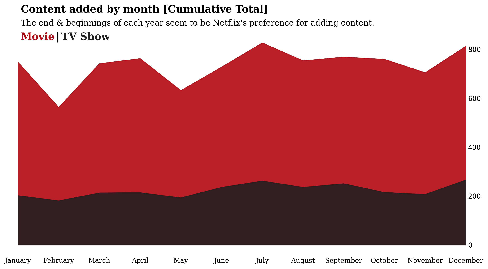
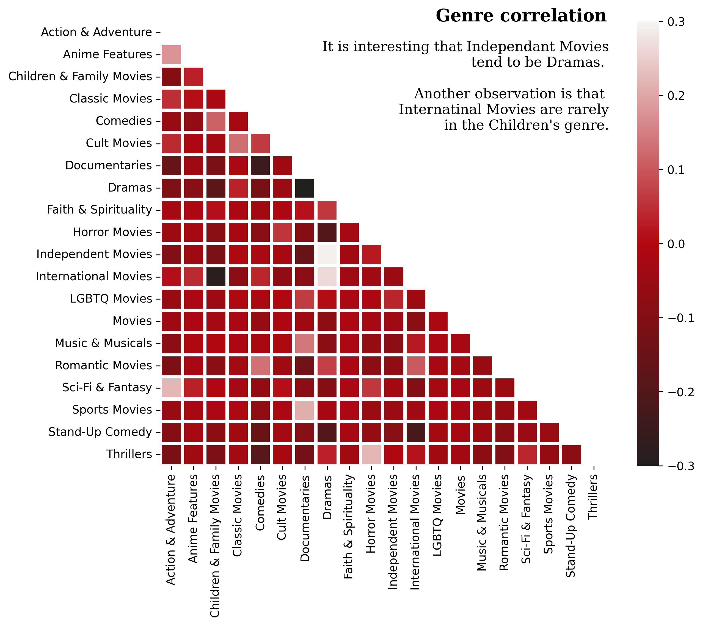
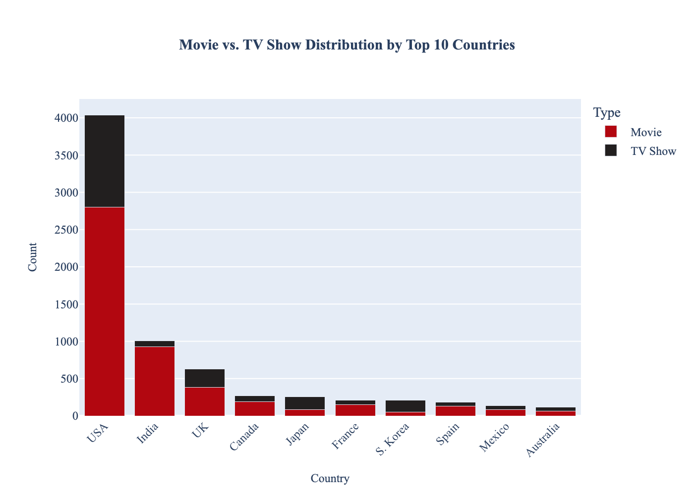
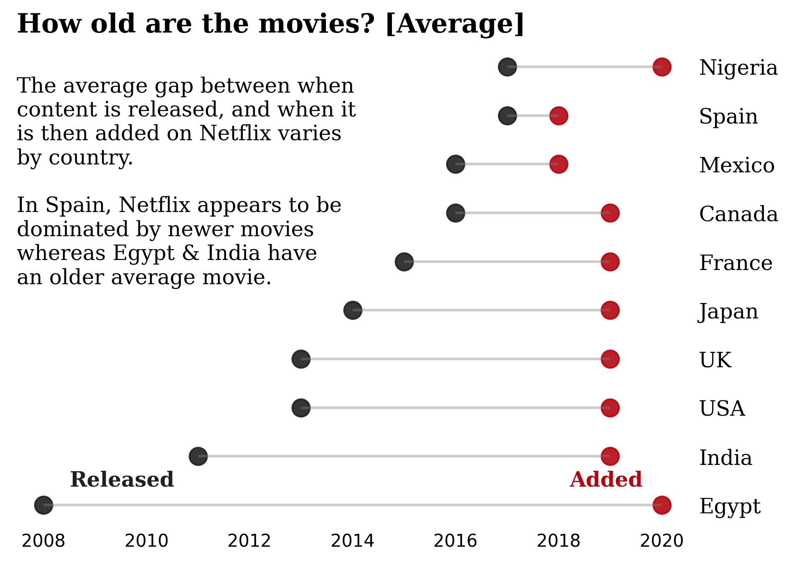

# Netflix Data Wrangling, Exploration & Metadata Enrichment

A comprehensive project for cleaning, exploring, visualizing, and enriching the Netflix Movies and TV Shows dataset.

---

## Project Structure

- **data/**: Contains all datasets, including raw, cleaned, and enriched metadata CSVs.
- **figures/**: All generated plots and visualizations.
- **images/**: Supporting images for reports or presentations.
- **data_cleaning_and_preprocessing.ipynb**: Data cleaning and preprocessing workflow.
- **exploratory_data_analysis_and_visualization.ipynb**: EDA and visualization notebook.
- **matadata_enrichment.ipynb**: Metadata enrichment and feature engineering.
- **README.md**: Project overview and documentation.

---

## Workflow Overview

### 1. Data Cleaning & Preprocessing

**Notebook:** [`data_cleaning_and_preprocessing.ipynb`](data_cleaning_and_preprocessing.ipynb)  
**Input:** [`data/netflix_titles.csv`](data/netflix_titles.csv)  
**Output:** [`data/netflix_titles_cleaned.csv`](data/netflix_titles_cleaned.csv)

- Handle missing values (e.g., impute `date_added` using `release_year`).
- Remove duplicates (e.g., by `show_id`).
- Standardize fields (e.g., `country`, `duration`).
- Validate with Pandas, NumPy, and Great Expectations.
- **Reference:** Data cleaning logic inspired by [Josh Swords: Netflix Data Visualization](https://www.kaggle.com/code/joshuaswords/netflix-data-visualization/notebook).

---

### 2. Exploratory Data Analysis (EDA) & Visualization

**Notebook:** [`exploratory_data_analysis_and_visualization.ipynb`](exploratory_data_analysis_and_visualization.ipynb)  
**Input:** [`data/netflix_titles_cleaned.csv`](data/netflix_titles_cleaned.csv)  
**Output:** Visualizations in [`figures/`](figures/)

- Analyze trends by `release_year`, `type`, `country`, and `rating`.
- Visualize genre distributions, content addition over time, and country breakdowns.
- Interactive dashboards using Plotly, static plots with Matplotlib/Seaborn.
- **Key Figures:**
  - Content added by month: 
  - Genre correlation: 
  - Movie vs TV Show by country: 
  - Age distribution: 
- **Reference:** Timeline visualization adapted from [Subin An's Titanic Visualization](https://www.kaggle.com/code/subinium/awesome-visualization-with-titanic-dataset). Age rating mapping adapted from [AndresHG's Netflix EDA](https://www.kaggle.com/code/andreshg/eda-beginner-to-expert-plotly).

---

### 3. Metadata Enrichment

**Notebook:** [`matadata_enrichment.ipynb`](matadata_enrichment.ipynb)  
**Input:** [`data/netflix_titles_cleaned.csv`](data/netflix_titles_cleaned.csv)  
**Output:** [`data/enriched_metadata_progress.csv`](data/enriched_metadata_progress.csv), [`data/netflix_titles_enriched.csv`](data/netflix_titles_enriched.csv)

- Integrate external metadata (IMDB, Rotten Tomatoes, Metacritic ratings).
- Feature engineering: genre tags, actor popularity, region mapping, sentiment analysis.
- Data quality improvements and text enrichment.
- **Reference:** API integration using OMDb API

---

## Data Sources

- **Original Dataset:** [Kaggle: Netflix Movies and TV Shows](https://www.kaggle.com/datasets/shivamb/netflix-shows)
- **Cleaned Dataset:** See [`data/netflix_titles_cleaned.csv`](data/netflix_titles_cleaned.csv)
- **Enriched Data:** See [`data/enriched_metadata_progress.csv`](data/enriched_metadata_progress.csv) and [`data/netflix_titles_enriched.csv`](data/netflix_titles_enriched.csv)

---

## Figures

All generated figures are available in the [`figures/`](figures/) directory.  
Example visualizations:
- `Content_added_by_month_Cumulative_Total.png`
- `Genre_correlation.png`
- `Movie_vs_TV_Show_Distribution_by_Top_10_Countries.png`
- `How_old_are_the_movies_Average.png`
- `How_old_are_the_TV_shows_Average.png`
- `Top_Countries_Release_Trends_Genre_Distribution_Rating_Breakdown.png`
- ...and more.

---

## Code Credits

- **Original EDA and visualization code:** [Josh Swords](https://www.kaggle.com/code/joshuaswords/netflix-data-visualization/notebook)
- **Timeline visualization:** [Subin An](https://www.kaggle.com/code/subinium/awesome-visualization-with-titanic-dataset)
- **Age rating mapping:** [AndresHG](https://www.kaggle.com/code/andreshg/eda-beginner-to-expert-plotly)
- **All other code:** Authored and adapted by project contributors.

---

## How to Reproduce

1. Install requirements:  
   ```sh
   pip install pandas numpy matplotlib seaborn plotly scikit-learn nltk textblob beautifulsoup4 imdbpy
   ```
2. Run notebooks in order:
   - `data_cleaning_and_preprocessing.ipynb`
   - `exploratory_data_analysis_and_visualization.ipynb`
   - `matadata_enrichment.ipynb`
3. View outputs in `data/` and `figures/`.

---

## License

This project is for educational and research purposes.  
Dataset © Netflix, sourced from Kaggle.

---